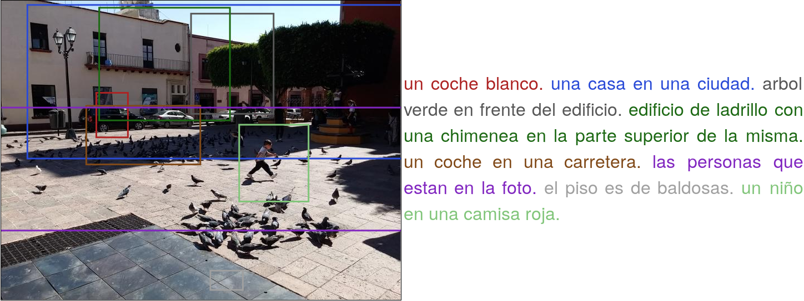

# Dense Captioning of Natural Scenes in Spanish
This is the dataset with Spanish captions for the paper 

Dense Captioning of Natural Scenes in Spanish  
Alejandro Gomez-Garay, Bogdan Raducanu, Joaquín Salas  
Presented at [MCPR 2018](http://ccc.inaoep.mx/~mcpr2018/index.html) (oral)  

The paper addresses the problem of construct and test a dataset of captions in Spanish for Image Captioning, and specifically Dense Captioning. The captions used were translated from [Visual Genome](https://visualgenome.org/api/v0/api_home.html) for [DenseCap](https://github.com/jcjohnson/densecap).  

The DenseCap model is a deep convolutional neural network trained in an end-to-end fashion on the Visual Genome dataset.  

We provide:  

    A dataset of captions in Spanish language (to get the [set in JSON format](https://drive.google.com/file/d/1WoSTwcjFnh11bBKdBOkVkaHtcJKKjJ0P/view?usp=sharing) 
     
If you find this dataset useful in your research, please cite:  

@inproceedings{densecap,  
  title={Dense Captioning of Natural Scenes in Spanish},  
  author={Gomez-Garay, Alejandro and Raducanu, Bogdan and Salas, Joaquín},  
  booktitle={Pattern Recognition-10th Mexican Conference, MCPR 2018, Puebla, Mexico, June 27-30, 2018, Proceedings},  
  year={2018}  
}  

As a derivation from [Visual Genome English captions](http://visualgenome.org/api/v0/api_home.html), we provide this dataset with the [Creative Commons CC BY 4.0 License](http://creativecommons.org/licenses/by/4.0/)
